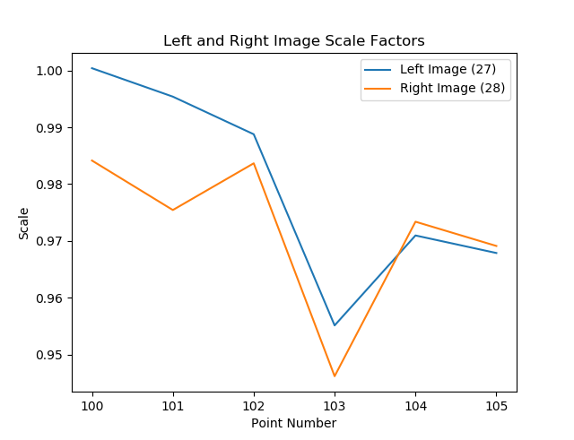
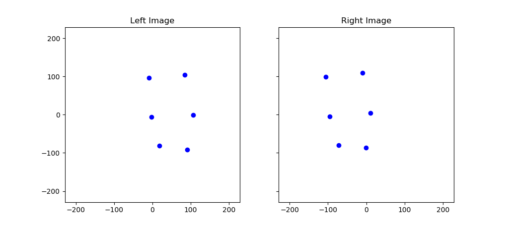

# Lab 3 Report

## Task 1 - Solved Unknowns
```
Number of iterations = 3
by = -1.422 mm
bz = -1.287 mm
omega = -0.97723 degrees
phi = 0.27326 degrees
kappa = -1.72863 degrees
```

## Task 2 - Convergence Criteria
* Distance
    * _Value_: Least squares corrections less than 0.1 micrometer
    * _Justification_: Order of magnitude less than comparator precision in image/model space
* Angle
    * _Value_: Least squares corrections less than 6.5e-7 radians
    * _Justification_: Approximately equal to 0.1 micrometer in image/model spapce, which is an order of magnitude less than comparator precision. Calculated as 0.0001 / c, where all units are in millimeters.

## Task 3 - Model Space Coordinates
```
  #    x (mm)    y (mm)    z (mm)
---  --------  --------  --------
100    -9.448    96.274  -153.421
101    84.642   103.258  -152.654
102    -2.292    -5.937  -151.638
103   101.196    -0.396  -146.476
104    18.370   -79.446  -148.905
105    87.389   -88.122  -148.432
```

## Task 4 - Y-Parallax
```
Y Parallax
  #    Parallax (mm)
---  ---------------
100           -0.003
101            0.002
102            0.006
103           -0.004
104           -0.005
105            0.004
```

I would not consider any of these observations to be possible outliers. The errors are within typical comparator precision of 5-10 micrometers (0.005-0.010 millimeters).

## Task 5 - Scale Factors


The scale factor changes in response to coordinate z-value (elevation)

## Task 5 - Correlation Coefficient Matrix
```
    by      bz    omega     phi    kappa
------  ------  -------  ------  -------
 1.000   0.049    0.988   0.069   -0.699
 0.049   1.000    0.109   0.699   -0.128
 0.988   0.109    1.000   0.121   -0.696
 0.069   0.699    0.121   1.000   -0.259
-0.699  -0.128   -0.696  -0.259    1.000
```

Omega and by are highly correlated (0.988). Tough to decorrelate these, as their influence is almost identical. If the Von Gruber points were spread more in the y-direction (close to image extremities), you might be able to distinguish the effect of a rotation about the x-axis from that of a translation in the y-direction a bit better.

**Von Gruber Locations**

